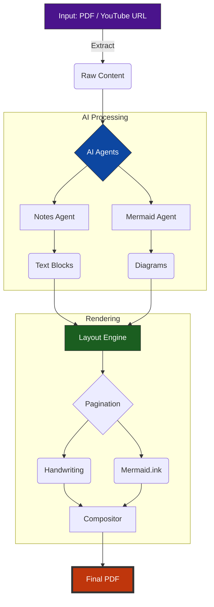
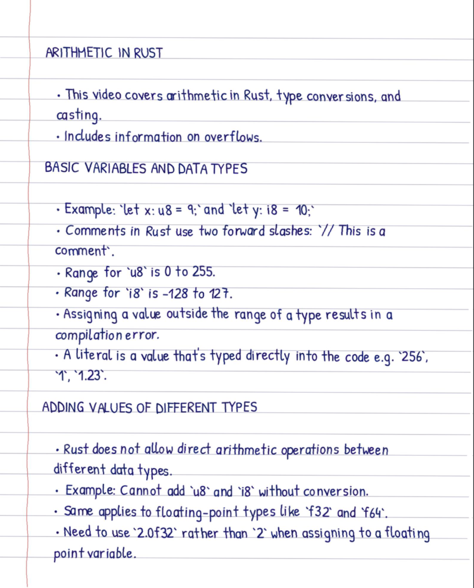

# .ink

**Intelligent Handwritten Note Generation**

.ink is an advanced document processing engine that transforms standard PDFs and YouTube transcripts into structured, professional handwritten notes. Beyond simple font conversion, it utilizes a sophisticated AI pipeline to analyze content, synthesize logical structures, and generate systemic diagrams that are seamlessly integrated into a realistic handwritten layout.

<table>
<tr>
<td width="50%">
<h3 align="center">System Architecture</h3>

</td>
<td width="50%">
<h3 align="center">Generated Output</h3>

</td>
</tr>
</table>

## Core Capabilities

.ink supports two input sources: **PDF documents** and **YouTube videos** (via transcript extraction). Both are processed through the same intelligent pipeline.

### 1. Intelligent Content Analysis (Agno Agents)
.ink employs a multi-agent AI system:
*   **Notes Agent**: Analyzes raw PDF text to extract key concepts, structuring them into a clean, hierarchical format with substantial headers and bullet points.
*   **Mermaid Agent**: Identifies complex relationships and processes within the text to generate valid Mermaid.js diagram definitions. It follows a strict "Systemic Logic" manifesto, ensuring diagrams represent causality, feedback loops, and inputs/outputs rather than simple associations.

### 2. Systemic Diagram Generation
*   **Vertical Layout Optimization**: The engine prioritizes Top-Down (`graph TD`) layouts to maximize diagram size and readability on portrait pages.
*   **Gigapixel Scaling**: Diagrams are treated as first-class citizens. The engine forces every diagram to upscale to the full width of the page (1400px), ensuring maximum visibility.
*   **Multi-Page Slicing**: If a diagram is too large to fit on a single page after upscaling, the engine automatically slices it into page-sized segments, spanning it across multiple consecutive pages without loss of detail.
*   **Robust Rendering**: Diagram requests use JSON-state encoding to handle special characters and complex syntax reliably.

### 3. Floating Layout Engine
The rendering system treats content as a fluid stream of "Blocks" (Text and Diagrams):
*   **Gap Filling**: If a large diagram must be moved to a new page to fit, the layout engine automatically fills the remaining space on the previous page with subsequent text, eliminating unprofessional vertical gaps.
*   **Strict Pagination**: Content flows continuously across pages, creating a cohesive notebook feel similar to a human-written journal.

### 4. Realistic Handwriting Synthesis
*   **Text Formatting**: Automatically parses Markdown syntax, converting headers to uppercase bold text and standardizing lists with bullet points.
*   **Visual Fidelity**: Incorporates realistic paper textures, ruled lines, and ink variability (though pressure is normalized for legibility) to create high-quality output images.

## Usage

Run the engine and provide your input (YouTube URL or PDF path).

**Example Output**: The transcript will be converted to handwritten notes and saved in the `output` directory.

## License

This project is licensed under the Apache License 2.0.
